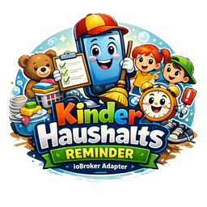

# ioBroker.reminder



**Kinder Haushalts Reminder** for ioBroker.

This adapter sends recurring WhatsApp reminders through `open-wa`, waits for a reply from the child, and then requires a confirmation reply from the parent.

## What it does

Typical flow:

1. At the configured weekday and time the adapter sends a message to the child.
2. The child can simply tap a generated `wa.me` link and send the prepared reply.
3. The adapter sends a confirmation request to the parent.
4. The parent can also tap a generated link and send `ja #CODE` without typing it manually.
5. The task is marked as confirmed.
6. If the child or the parent does not answer, reminders are resent after the configured number of hours.

Every open process gets its own reference code so multiple tasks can run in parallel without getting mixed up.

## Important note about the package name

The repository is `ioBroker.reminder`, but the adapter package in this project is **`iobroker.reminder`** and the namespace is **`reminder.X`**.
That keeps the adapter namespace as one clean segment inside ioBroker.

## Requirements

- ioBroker with a current js-controller
- an `open-wa` instance for outgoing WhatsApp messages
- optional: the WhatsApp number behind `open-wa` so the adapter can generate click-to-reply links
- one of these options for incoming replies:
  - a configured state that receives the latest incoming message JSON, or
  - `sendTo('reminder.X', 'incoming', payload)` from another script/adapter

## Important note about chat IDs

For outgoing messages a plain phone number may work, but for matching incoming replies you should use the exact incoming WhatsApp ID when necessary.
If your incoming payload contains IDs like `...@lid`, copy exactly that value from `info.lastIncoming` into the task configuration.

## open-wa outgoing format

The adapter sends WhatsApp messages with:

```js
sendTo('open-wa.0', 'send', {
  to: '4917012345678@c.us',
  text: 'Bitte die Treppe absaugen.'
});
```

## Accepted incoming JSON

The adapter accepts incoming JSON payloads in this shape:

```json
{
  "from": "4917012345678@c.us",
  "text": "erledigt #TREPPE-4821",
  "timestamp": 1713612300000,
  "messageId": "ABCD1234"
}
```

It also accepts payloads like:

```json
{
  "ts": "2026-04-20T16:50:50.404Z",
  "from": "3264309387362@lid",
  "chatId": "3264309387362@lid",
  "body": "erledigt #TREPPE-7510"
}
```

The parser is tolerant and also tries these fields when present:

- `chatId`, `sender`, `fromId` for the sender
- `body`, `message`, `caption` for the text
- `ts` for the timestamp, including ISO timestamps
- `id` for the message id

## Adapter configuration

### General

- **open-wa instance**: target instance used for outgoing messages
- **Incoming message state ID**: optional foreign state containing the latest incoming JSON
- **WhatsApp number for click-to-reply links**: optional. Example `491791514520`
- **History entries to keep**: maximum number of history entries persisted and exposed in states
- **Store last incoming message**: writes the last accepted incoming payload to `info.lastIncoming`

### Tasks

Each task row defines one recurring reminder:

- enabled
- id
- title
- message
- weekday
- time (`HH:mm`)
- child chat ID
- parent chat ID
- reminder interval for child in hours
- reminder interval for parent in hours
- accepted child keywords, comma-separated
- accepted parent keywords, comma-separated

Example task:

- title: `Treppe absaugen`
- message: `Bitte die Treppe absaugen.`
- weekday: `Wednesday`
- time: `17:00`
- child keywords: `erledigt,fertig,done`
- parent keywords: `ja,bestaetigt,bestätigt,ok`

## Runtime states

### Static states

- `reminder.0.info.connection`
- `reminder.0.info.lastAction`
- `reminder.0.info.lastIncoming`
- `reminder.0.runs.activeJson`
- `reminder.0.runs.historyJson`
- `reminder.0.commands.processIncomingJson`

### Per task

For every configured task the adapter creates:

- `tasks.<taskId>.status.state`
- `tasks.<taskId>.status.refCode`
- `tasks.<taskId>.status.startedAt`
- `tasks.<taskId>.status.childDoneAt`
- `tasks.<taskId>.status.parentConfirmedAt`
- `tasks.<taskId>.status.childReminderCount`
- `tasks.<taskId>.status.parentReminderCount`
- `tasks.<taskId>.status.lastScheduleDate`
- `tasks.<taskId>.status.summary`
- `tasks.<taskId>.commands.trigger`
- `tasks.<taskId>.commands.reset`

## Manual testing

### Inject an incoming message through a state

Write JSON to:

`reminder.0.commands.processIncomingJson`

Example value:

```json
{"from":"4917012345678@c.us","text":"erledigt #TREPPE-4821","timestamp":1713612300000}
```

### Inject an incoming message through messagebox

```js
sendTo('reminder.0', 'incoming', {
  from: '4917012345678@c.us',
  text: 'ja #TREPPE-4821',
  timestamp: Date.now()
});
```

### Trigger a task manually

Set this state to `true`:

`reminder.0.tasks.<taskId>.commands.trigger`

### Reset an open run

Set this state to `true`:

`reminder.0.tasks.<taskId>.commands.reset`

## Build

```bash
npm install
npm run build
```

## License

MIT
